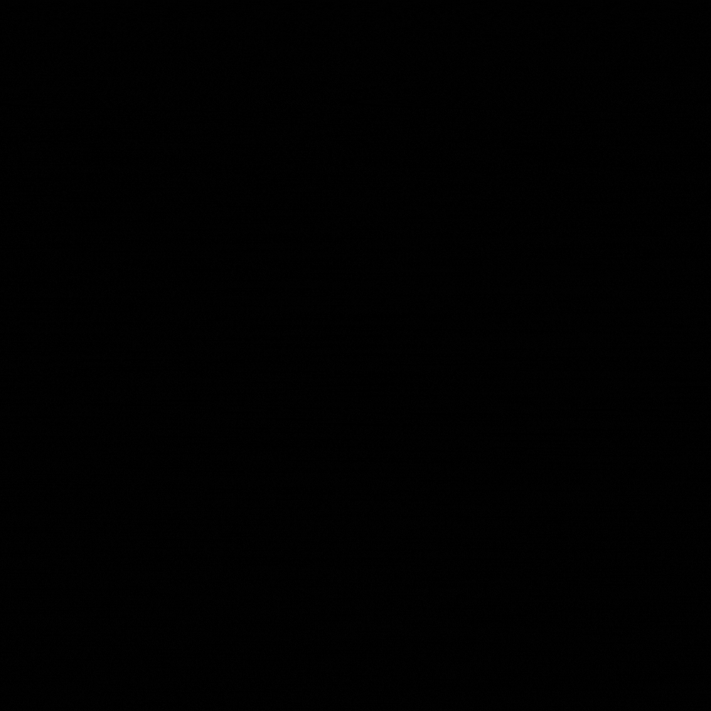

# YoRuSplScr - Easy Splash Screen for Raylib Games 🎮

A lightweight, easy-to-use splash screen implementation for Raylib games and applications. Add professional animated intros to your projects in minutes!



## ✨ Features

- Animated GIF support
- Customizable display duration
- Adjustable animation speed
- Simple integration with any Raylib project
- Proper resource management
- Resizable to fit any screen

## 🚀 Installation

1. Add the `YoRuSplScr.h` and `YoRuSplScr.cpp` files to your project
2. Include the header file in your main code
3. Prepare a GIF file for your splash screen

## 📋 Usage

### Basic Implementation

```cpp
#include "raylib.h"
#include "YoRuSplScr.h"

int main() {
  // Initialize window
  InitWindow(800, 600, "My Game");
  SetTargetFPS(60);

  // Create splash screen
  // Parameters: GIF path, frames count, display time (seconds), frames per second
  SplashScreen splash("resources/splash.gif", 10, 5.0f, 10.0f);

  while (!WindowShouldClose()) {
    // Update splash screen and check if it's complete
    if (splash.Update(GetFrameTime())) {
      // Splash screen is complete, you can transition to your game
    }

    BeginDrawing();
      ClearBackground(BLACK);

      if (!splash.IsComplete()) {
        splash.Draw();
      } else {
        // Draw your game here
        DrawText("Welcome to the game!", 260, 300, 20, WHITE);
      }
    EndDrawing();
  }

  CloseWindow();
  return 0;
}
```

### Constructor Parameters

```cpp
SplashScreen(const char* gifPath, int frames, float displayTime, float framesPerSecond);
```

- **gifPath**: Path to your GIF file
- **frames**: Number of frames in your GIF
- **displayTime**: How long to display the splash screen (in seconds)
- **framesPerSecond**: Animation speed (frames per second)

### Methods

- **Update(float deltaTime)**: Updates the animation, returns true when complete
- **Draw()**: Renders the splash screen
- **IsComplete()**: Checks if the splash screen has finished
- **Reset()**: Resets the splash screen to play again
- **AdjustToScreenSize()**: Adjusts splash screen to fit current window
- **SetFramesPerSecond(float fps)**: Changes animation speed

## 📝 Notes

- The splash screen automatically centers in the window
- Make sure your GIF file is properly formatted and accessible
- For best results, create a GIF with dimensions that match your aspect ratio

## 🛠️ Requirements

- Raylib library
- C++ compiler

## 📄 License

This project is free to use in both personal and commercial projects.

---

Made with ❤️ by YoRu
